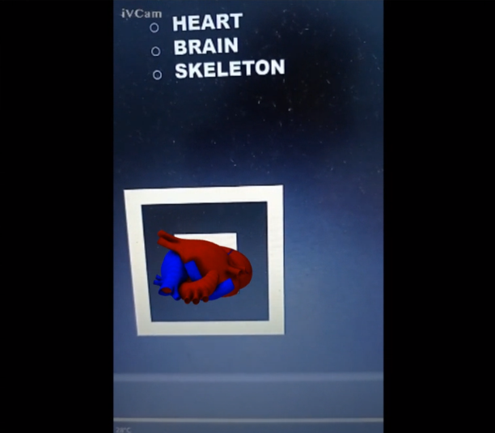
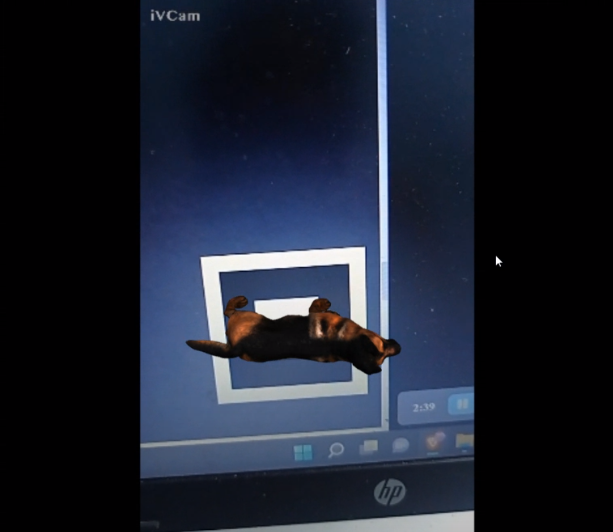
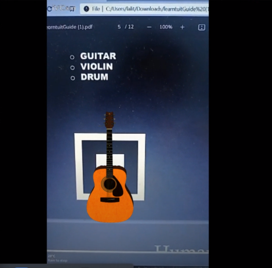

# LEARNTUIT
---
>
>[LEARNTUIT](https://learntuit.netlify.app/) is learning platform for kids to know about alphabets, geometrical shapes and also helpful to students who want to know about organs and molecules using Augmented Reality
>
>Demo: [Link](https://www.awesomescreenshot.com/video/9999751?key=a29a6af6d03104fcd508043eabe13ffd)
>
>## Features
>
>### Categories:
>- Alphabets
>- Instruments
>- Shapes
>- Human Body
>- Molecules
>- Animals
>- Vehicles
>- Electronics
>- Sports
>
>### ScreenShots
>
>
>
>
>
>
>
>
>

